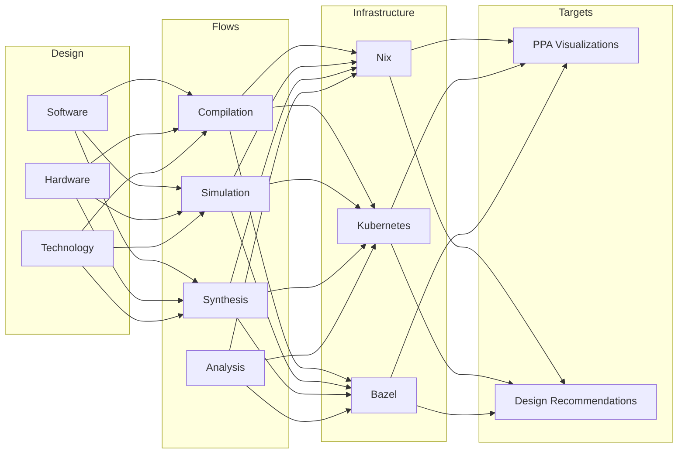
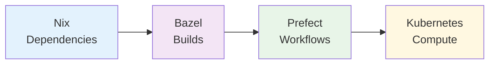
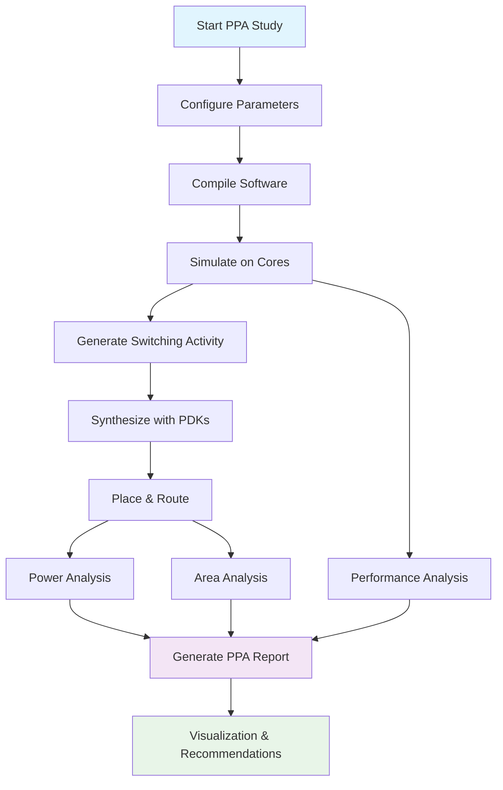
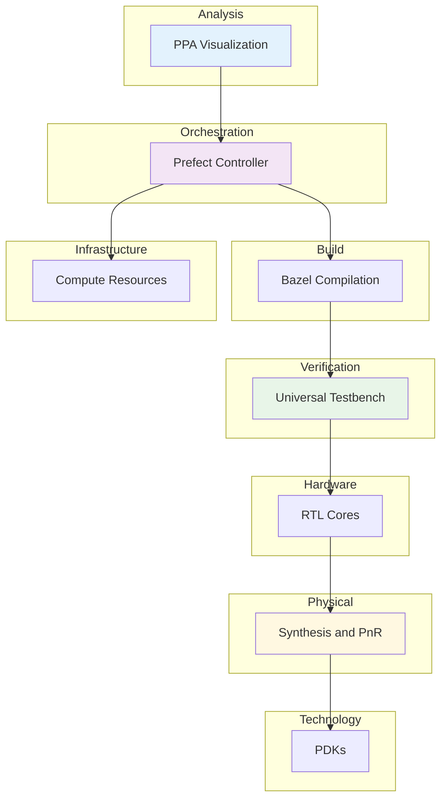
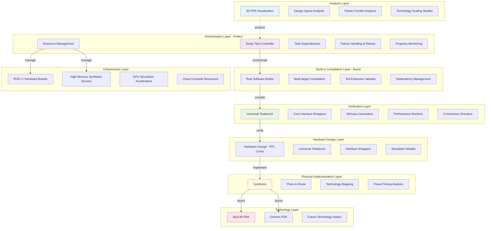

```mermaid
graph LR
    subgraph "Unix Philosophy Applied"
        A["🔧 Nix<br/>Dependencies &<br/>Reproducible Envs"]
        B["🏗️ Bazel<br/>Builds &<br/>Intelligent Caching"]  
        C["🔄 Prefect<br/>Workflow<br/>Orchestration"]
        D["☸️ Kubernetes<br/>Distributed<br/>Computing"]
    end
    
    subgraph "Clean Interfaces"
        A -->|provides env| B
        B -->|builds artifacts| C  
        C -->|launches tasks| D
        D -->|schedules on| E["💻 Compute Resources"]
    end
    
    subgraph "Single Responsibilities"
        A1["✅ Nix: Do ONE thing well<br/>• Reproducible environments<br/>• Dependency management<br/>• Version pinning"]
        
        B1["✅ Bazel: Do ONE thing well<br/>• Build orchestration<br/>• Incremental compilation<br/>• Artifact caching"]
        
        C1["✅ Prefect: Do ONE thing well<br/>• Workflow dependencies<br/>• Resource allocation<br/>• Monitoring & retries"]
        
        D1["✅ Kubernetes: Do ONE thing well<br/>• Container scheduling<br/>• Resource management<br/>• Service discovery"]
    end
    
    subgraph "Composability Benefits"
        F1["🔄 Easy to Replace<br/>• Swap Bazel → Buck2<br/>• Swap K8s → Nomad<br/>• Swap Prefect → Airflow"]
        
        F2["🐛 Easy to Debug<br/>• Each layer isolated<br/>• Clear responsibility<br/>• Simple interfaces"]
        
        F3["📈 Easy to Scale<br/>• Add tools independently<br/>• No vendor lock-in<br/>• Incremental adoption"]
    end
    
    style A fill:#e3f2fd
    style B fill:#f3e5f5  
    style C fill:#e8f5e8
    style D fill:#fff8e1
    style A1 fill:#e3f2fd
    style B1 fill:#f3e5f5
    style C1 fill:#e8f5e8 
    style D1 fill:#fff8e1
```

# RISC-V PPA Study Architecture

## Directory Structure

```
riscv-ppa-study/
├── WORKSPACE.bazel                 # Bazel workspace configuration
├── MODULE.bazel                    # Bazel module dependencies
├── BUILD.bazel                     # Root build file
├── .bazelrc                        # Bazel configuration
├── README.md                       # Project documentation
│
├── design/                         # Design artifacts (what we're studying)
│   ├── software/                   # Software applications and benchmarks
│   │   ├── common/                 # Shared utilities and profiling
│   │   ├── fft/                    # FFT benchmark variants
│   │   ├── matrix_mult/            # Matrix multiplication workloads
│   │   └── crypto/                 # Cryptographic workloads
│   │
│   └── hardware/                   # Hardware design and implementation
│       ├── rtl/                    # RTL design and simulation
│       │   ├── cores/              # RISC-V core designs (Rocket, VexRiscv, CVA6)
│       │   ├── testbench/          # Universal parameterized testbench
│       │   ├── simulation/         # RTL simulation infrastructure
│       │   └── common/             # Shared RTL components
│       │
│       └── physical/               # Physical implementation (PDK-dependent)
│           ├── sky130/             # SkyWater 130nm implementation
│           ├── generic/            # Generic/educational PDK
│           ├── future_nodes/       # Advanced technology nodes
│           └── common/             # PDK-independent utilities
│
├── flows/                          # Process definitions (how designs flow through infrastructure)
│   ├── main_study_flow.py          # Complete PPA study orchestration
│   ├── software_flow.py            # Software compilation and execution
│   ├── simulation_flow.py          # RTL simulation workflows
│   ├── synthesis_flow.py           # Physical implementation workflows
│   ├── analysis_flow.py            # Results analysis workflows
│   │
│   ├── tasks/                      # Individual process steps
│   ├── bazel/                      # Build process definitions
│   └── utils/                      # Flow utilities and common steps
│
├── infrastructure/                 # Infrastructure & environment (where we execute)
│   ├── nix/                        # Reproducible tool environments
│   ├── kubernetes/                 # Distributed compute orchestration
│   ├── terraform/                  # Infrastructure provisioning
│   ├── cloud-research/             # Research area for deployment tools
│   └── targets/                    # Hardware execution environments
│
├── analysis/                       # Results processing and outputs
│   ├── scripts/                    # Analysis and visualization tools
│   ├── data/                       # Raw measurement data (flow outputs)
│   └── targets/                    # Final study deliverables
│
├── docs/                           # Documentation
├── third_party/                    # External dependencies
└── configs/                        # Environment configurations
```

## Conceptual Model: Design → Flows → Infrastructure → Targets



## Tool Philosophy: Composition of Simple, Well-Defined Tools



## Prefect Pipeline Flow



## Architecture Stack



## Tool Philosophy: Composition of Simple, Well-Defined Tools



## Prefect Pipeline Flow


## Architecture Stack



## Core Design Principles

### Mental Model
**Design Artifacts** (the subject matter) → **Process Flows** (the methodology) → **Infrastructure** (the execution environment) → **Target Results** (the deliverables)

### Tool Responsibilities
- **Nix**: Reproducible environments and dependency management
- **Bazel**: Build orchestration and intelligent caching  
- **Prefect**: Workflow execution and pipeline orchestration
- **Kubernetes**: Scalable distributed computing

### Key Architectural Benefits
- **Clean separation**: Design (what) vs Flows (how) vs Infrastructure (where) vs Targets (results)
- **Universal testbench**: Single verification environment for fair core comparison
- **PDK-separated physical implementation**: Technology-specific synthesis flows
- **Composable tools**: Each tool excels in its domain with clean interfaces
- **3D analysis space**: Core design × PDK technology × software workloads

### Implementation Philosophy
Following Unix philosophy: compose simple tools that do one thing exceptionally well, rather than building monolithic solutions. This trades implementation complexity (building custom tools) for operational complexity (managing multiple specialized tools).